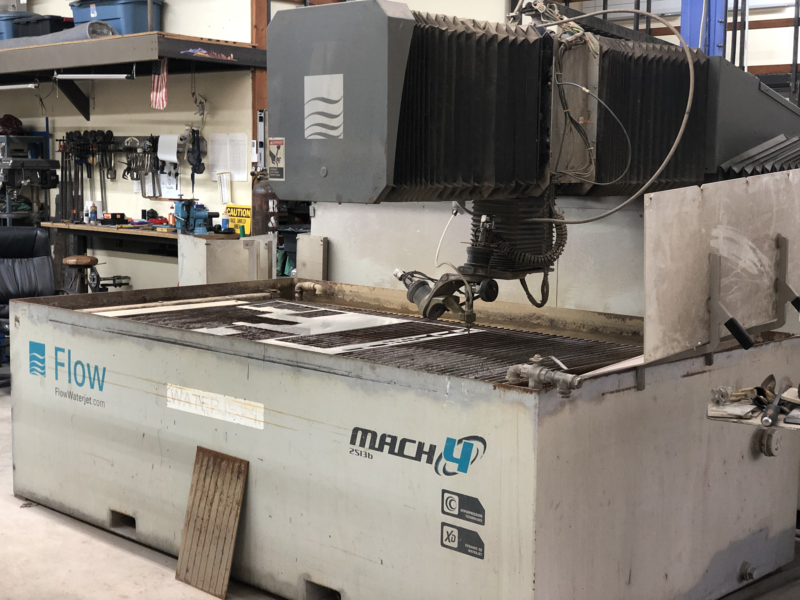
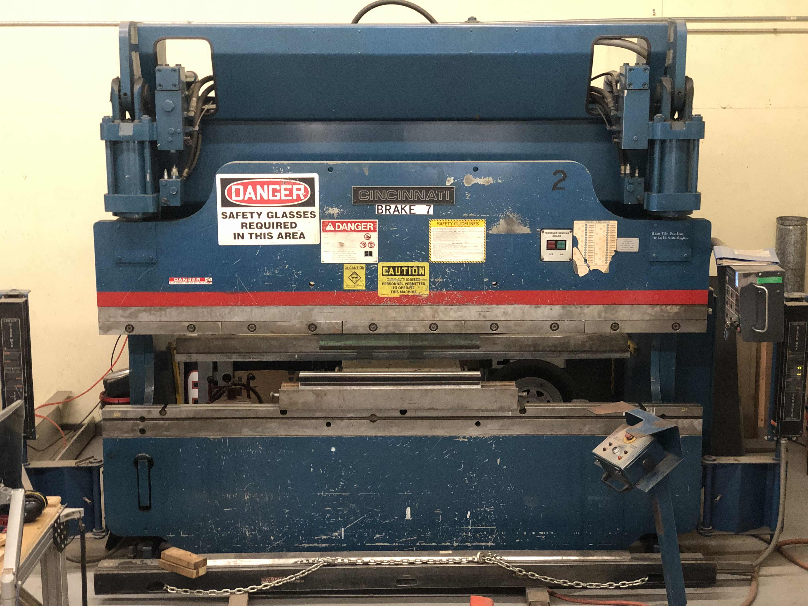

---
---

### JKV is your perfect partner to handle one-off to low volume custom fabrication work. 

# Residential, Commercial, or Industrial Buildings

* Staircases and railing
* Walkways, platforms
* Various structural elements
* Metal signs (with or without integrated lighting)
* EV chargers
* Furniture (table, shelving, partition, etc.)
* Decorative elements

# Vehicle Modifications

* Commercial van upfitting
* Custom commercial truck modifications

<h1 id="equipment">Our Equipment and Capabilities</h1>

- CNC Waterjet cutting on our Flow Mach IV (5'x8' capacity) - Steel, Stainless Steel, Aluminum, Plastics, Composites, Stone, etc.
- CNC machining on 2 routers (wood, plastic, composites, and aluminum)
- CNC Press-Brake Sheetmetal Bending (up to 10' length and 1/2" thickness)
- CNC Tube Bending (0.5" to 2.0" steel tubing up to schedule 40 wall thickness)
- Welding (TIG, AC/DC-Pulse MIG, Stick)

