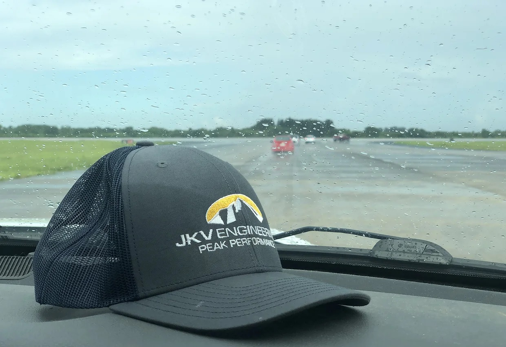

import { Link } from "gatsby"
import MdxWrapper from "../components/mdx-wrapper"
import Seo from "../components/seo"
export const Head = () => <Seo title="About JKV"/>
export default ({children}) => <MdxWrapper title="About JKV">{children}</MdxWrapper>

JKV Engineering LLC is a small group of passionate engineers based in Milford Ohio, just outside of Cincinnati. Whether you are looking for a full-service engineering contractor or just need help with a subset of your project, we will deliver great results for you. No matter how complicated or simple the project, we love seeing the job done well and done right.

# What We Offer 

## Engineering Services 

...where our experience base enhances our client’s engineering team.  In these type of engagements we support our customer’s development from concept selection through design for manufacturing.  Our activities as an engineering service provider include development of concept selection matrices, 3D CAD modeling, CAE (simulation and mathematical modeling), DFMEA, BOMs, Drawing packages, test plans/physical testing, and more.  We’ve worked with clients around the US and globally, on multiple year engineering programs.      

## Rapid, Engineered, Prototypes

...for companies developing new products.   Our unique advantage is that we produce high quality designs, bills of materials, CAD models, and drawings, in the same building where we have significant manufacturing capability.  At the end of a project we deliver a well organized engineering package along with a very high quality, functional prototype.  Often these first articles along with the engineering package are extremely useful to help our customers quickly bring new products to market.

## Systems Engineering

JKV has offered full systems engineering under one roof since it was started.  This means physical equipment with sensors, and feedback motion control.  We gained this expertise developing control systems for vehicle applications including, powertrain control, engine control, thermal management system control, HVAC, and more.  We save our customers time and money by helping to design the physical system and then the electrical design, sensor package, control loops, and HMIs.    We can develop control systems on embedded microprocessors or PLCs.

## Fabrication Services

...have always been a key component of what we do.  We’ve fabricated everything from industrial equipment to mobile equipment (cars and trucks) to architectural installations and more.

### Our Engineering and Fabrication facility has the following capabilities

* 5 Axis Waterjet Cutting of almost any material
* 90 Cincinnati CNC press brake
* OTC programable pulse MIG welder for Aluminum, SS, Steel

# Our team

Click <Link to="/team">here</Link> to read the bio from each of our engineers.

# Project Examples

You can find some examples of our work <Link to="/projects">here</Link>.