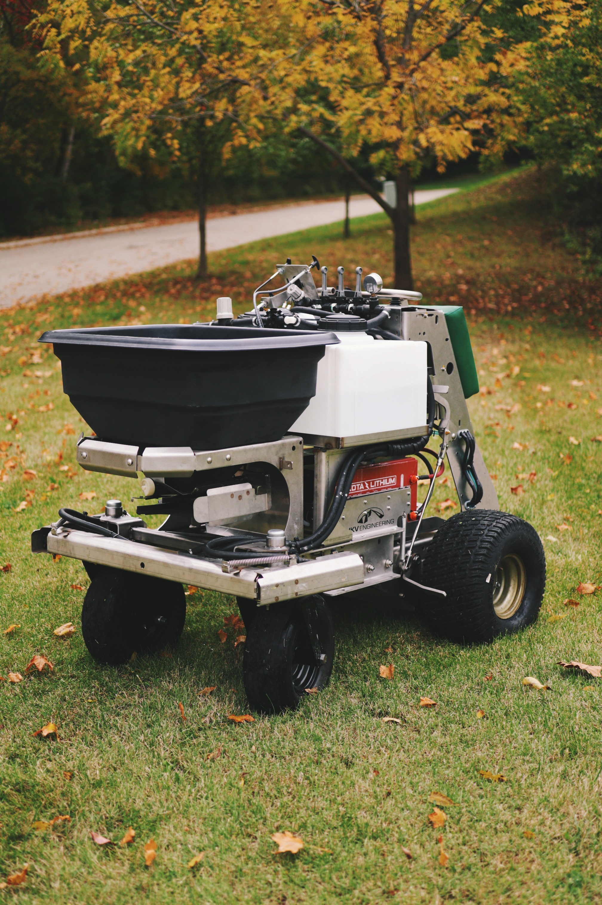
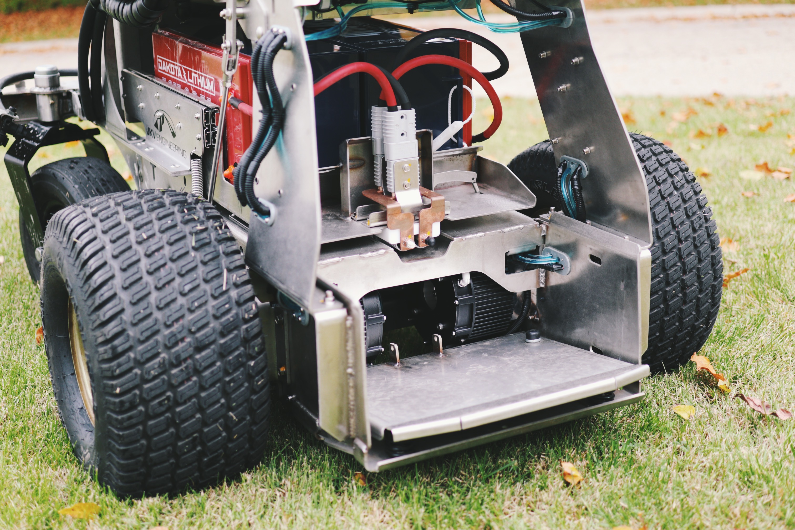
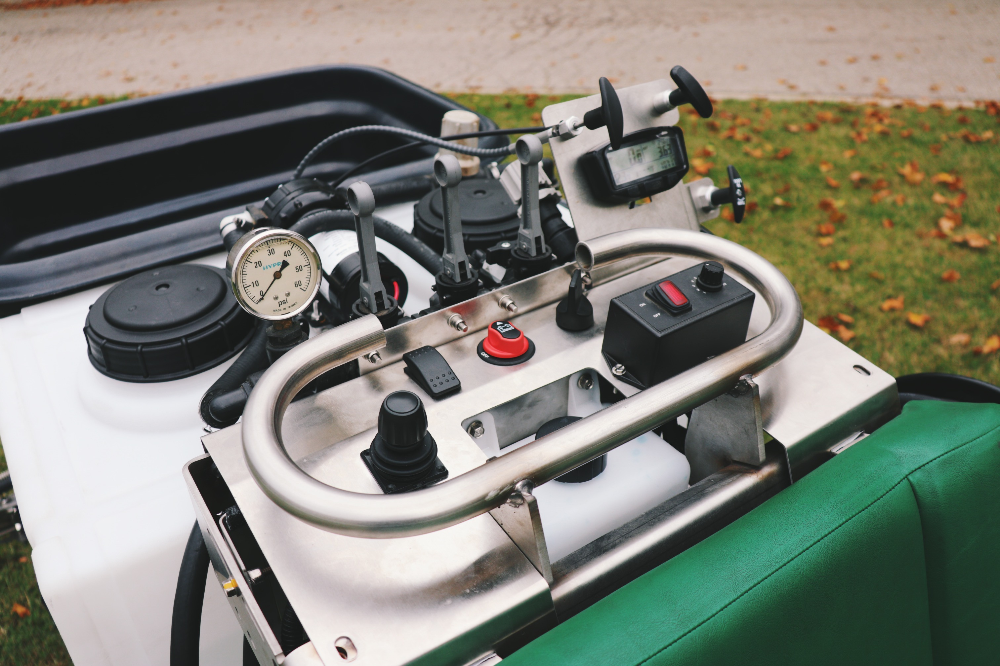
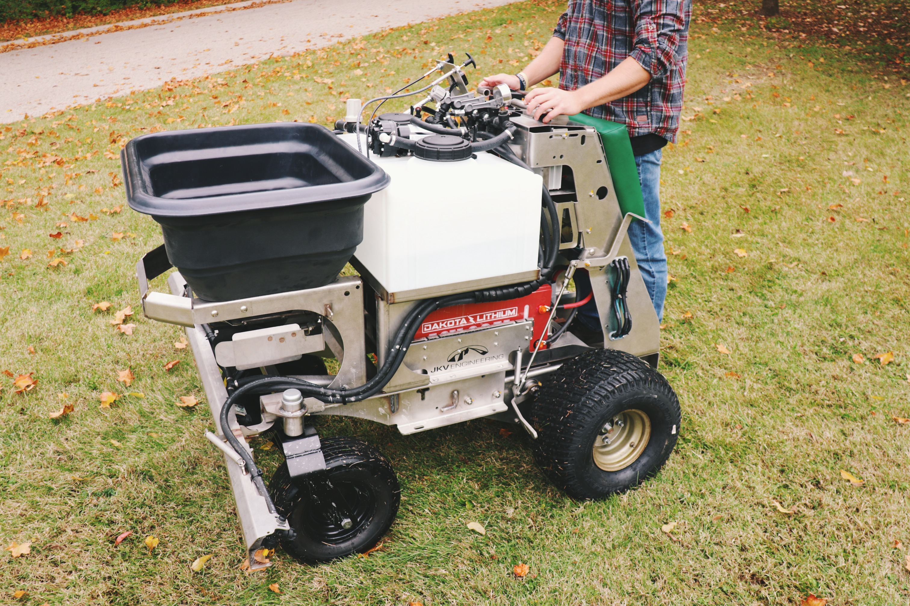
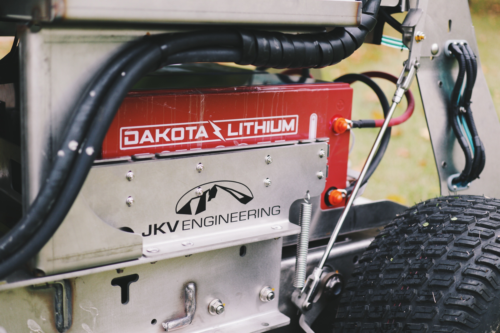

# Project Idea

JKV has an established long-term relationship with a local lawn care company, providing them with engineering and fabrication support for their fleet of equipment. As we became familiar with their equipment and use case, we started to see a business case for an electric fertilizer spreader.

# The Result

This completed Zero-Turn Machine is easy to use and lasts all day (8 Hours of continued usage on a full charge).  JKV chose to trial a new method of operation for this type of machine to allow easier, more ergonomic single-hand operation of the drive controls, so we fitted it with a single joystick to that provides the acceleration, deceleration and turning commands from the operator. 

## Specification

- 6-8 Hour Run-Time (dependent upon operating conditions, load, etc.)
- Patent Pending Tool-Less, Flexible Capacity 10/5 kW-hr Battery System featuring (2) 48V/96Ah Dakota Lithium Batteries with safe LiFePO4 chemistry → 6 Hour Re-Charge Time
- All operator controls for fertilizer slinger, sprayer pump, joystick drive controls located on centralized control panel
- 2-wheel mechanical parking brake
- 2 X 12-gallon sprayer tanks (configurable to customer req’t)
- 1 X 220lb. Hopper
- 46” Overall Machine Width (Sprayer Booms Folded Inward)
- Turnkey Electric Spreader/Sprayer machine can be operated by anyone
- Enhanced Safety Features
- Concrete $5,100 per year savings over gas machines (based only on fuel/maintenance and uptime).
- Larger operating window due to significantly lower noise emissions
- Less operator fatigue

The Electric Spreader is powered by a couple of Dakota Lithium batteries (available for puchase at the [JKV Shop](https://shop.jkvengineering.com)), for a total of 48 Volt and 192 Ah, or 9.2 Kw.

Everything about the machine, including power management, maneuvability, etc., is all programmed by JKV, and therefore, fully customizable.

That's one of the greatest advantages of working with JKV - from concept, to the physical build, to the software programming, we can handle it all and are fully commited to perfecting it until our customers are happy, and we are proud of it.

Watch the Electric Spreader/Sprayer in action below:

<iframe src="https://www.facebook.com/plugins/video.php?height=314&href=https%3A%2F%2Fwww.facebook.com%2FJKVEngineering%2Fvideos%2F1345777123001226%2F&show_text=false&width=560&t=0" width="560" height="314" style="border:none;overflow:hidden" scrolling="no" frameborder="0" allowfullscreen="true" allow="autoplay; clipboard-write; encrypted-media; picture-in-picture; web-share" allowFullScreen="true"></iframe>

# What's Next?

We are putting in the miles to test its robustness, operability, and to look for opportunities of further refinement. So far, we all agree that this machine is impressive!

We are looking for potential customers of the Electric Spreader. Do you work in the lawn care industry, or do you know of someone who does? If so, please [get in touch](/contact) with us!

# Learn More

* [Buy Dakota Lithium Batteries at the JKV Shop](https://shop.jkvengineering.com)

 

Did this article inspire a project idea of your own? We would love to work on it together. Please [contact us](/contact)!